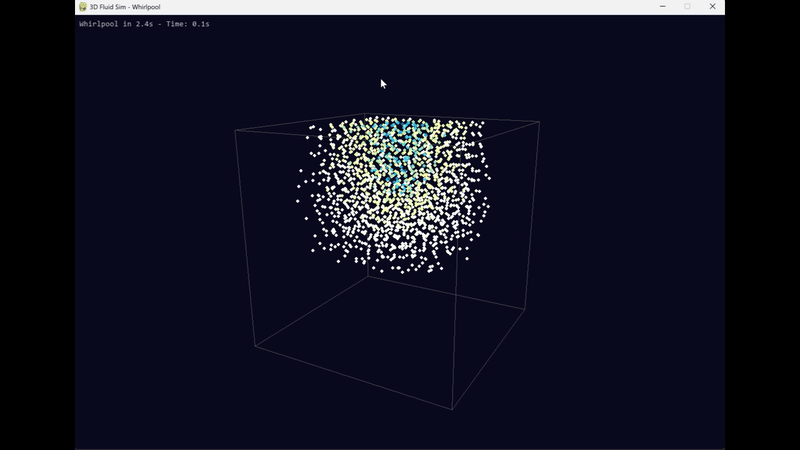

# 2D & 3D Fluid Simulation: Python & Mojo Implementation

A high-performance particle-based fluid simulator implemented in both **pure Python** and **Mojo** (with Python rendering) for both 2D and 3D simulations. This project demonstrates the performance difference between interpreted Python and compiled Mojo code, while maintaining identical simulation physics.

## 2D Simulations

|  |  |
|:----------------------------------------------:|:------------------------------------------:|
|           **Python Implementation**            |          **Mojo Implementation**           |

## 3D Simulations

|  |  |
|:------------------------------------------------------:|:---------------------------------------------------:|
|           **Python 3D Implementation**                  |     **Mojo 3D Implementation (Spatial Hashing)**   |

> **Inspired by**: [Sebastian Lague's Fluid Simulation Episode 01](https://www.youtube.com/watch?v=rSKMYc1CQHE)  
> Special thanks to Sebastian Lague for the excellent tutorial and Unity implementation that served as the foundation for this project.

---

## 📋 Table of Contents

- [Overview](#-overview)
- [Architecture](#-architecture)
- [Features](#-features)
- [Installation](#-installation)
- [Usage](#-usage)
- [Core Functions & Components](#-core-functions--components)
- [Performance Comparison](#-performance-comparison)
- [Project Structure](#-project-structure)
- [Technical Details](#-technical-details)
- [Contributing](#-contributing)
- [License](#-license)
- [Acknowledgments](#-acknowledgments)
- [Further Reading](#-further-reading)

---

## 🎯 Overview

This project implements **Smoothed Particle Hydrodynamics (SPH)**-based fluid simulations in both 2D and 3D, with implementations in both pure Python and Mojo:

### 2D Implementation

1. **Pure Python Version** (`fluid_sim_2d.py`): A complete, self-contained 2D implementation using pygame for visualization. Great for learning and understanding the algorithm.

2. **Mojo + Python Hybrid** (`mojo-simulation-2D/`): A high-performance 2D implementation where:
   - **Mojo** (`fluid_sim_core.mojo`) handles all computation-intensive simulation logic
   - **Python** (`fluid_render_client.py`) handles rendering and visualization
   - Communication happens via **stdin/stdout pipe**, keeping concerns separated

### 3D Implementation

1. **Pure Python Version** (`fluid_sim_3d_scenarios.py`): A complete, self-contained 3D implementation with scenario support (e.g., whirlpool effects). Features perspective projection, camera controls, and speed-based particle coloring.

2. **Mojo + Python Hybrid** (`mojo-simulation-3D/`): A high-performance 3D implementation where:
   - **Mojo** (`fluid_sim_core_3d.mojo` or `fluid_sim_core_3d_v1.mojo`) handles all computation-intensive simulation logic
   - **Python** (`fluid_render_client_3d.py`) handles 3D rendering with perspective projection and camera controls
   - Communication happens via **stdin/stdout pipe**, maintaining the same architecture as the 2D version

The Mojo versions demonstrate significant performance improvements while maintaining identical physics behavior.

---

## 🏗️ Architecture

### How Mojo and Python Work Together

The hybrid implementation uses a **producer-consumer pattern** via Unix pipes:

```
┌─────────────────────┐         stdout         ┌──────────────────────┐
│  fluid_sim_core.mojo│ ────────────────────>  │ fluid_render_client  │
│  (Simulation Logic) │                        │    (Rendering)       │
│                     │ <────────────────────  │                      │
└─────────────────────┘         stdin          └──────────────────────┘
```

#### Data Flow

1. **Mojo Simulation** (2D: `fluid_sim_core.mojo`, 3D: `fluid_sim_core_3d.mojo`):
   - Runs the physics simulation at 60 FPS
   - Calculates particle positions, velocities, densities, and collisions
   - Outputs one line per frame to **stdout** with format:
     - **2D**: `F <frame> <collisions> <bounds_w> <bounds_h> <obstacle_x> <obstacle_y> <obstacle_w> <obstacle_h> <particle_count> x0 y0 vx0 vy0 x1 y1 vx1 vy1 ...`
     - **3D**: `F <frame> <collisions> <bounds_w> <bounds_h> <bounds_d> <scenario_active> <whirlpool_x> <whirlpool_y> <whirlpool_z> <whirlpool_radius> <particle_count> x0 y0 z0 vx0 vy0 vz0 x1 y1 z1 vx1 vy1 vz1 ...`

2. **Python Renderer** (2D: `fluid_render_client.py`, 3D: `fluid_render_client_3d.py`):
   - Reads frame data from **stdin** (blocking read)
   - Parses particle positions and velocities
   - Renders using pygame:
     - **2D**: Draws bounds box, obstacle rectangle, particles with speed-based color gradient, FPS and collision graphs
     - **3D**: Draws 3D bounds, particles with perspective projection, camera controls (mouse drag, arrow keys, zoom), speed-based coloring, and scenario visualization (e.g., whirlpool center and radius)

3. **Communication Protocol**:
   - **One-way**: Mojo → Python (simulation → rendering)
   - **Synchronous**: Python blocks waiting for each frame
   - **Text-based**: Space-separated values for easy parsing
   - **No shared memory**: Complete process isolation

#### Why This Architecture?

- **Separation of Concerns**: Simulation logic (Mojo) is completely independent from rendering (Python)
- **Performance**: Mojo's compiled code handles the O(n²) neighbor searches efficiently
- **Flexibility**: Easy to swap renderers (could use OpenGL, WebGL, etc.)
- **Debugging**: Can run Mojo standalone and inspect output, or run Python with test data
- **Portability**: Standard Unix pipes work on Linux, macOS, and Windows (WSL)

---

## ✨ Features

### Simulation Features

- **SPH Fluid Dynamics**:
  - Density calculation using Spiky kernels (pow2 and pow3)
  - Pressure forces based on density deviation from target
  - Viscosity forces for smooth particle interactions
  - Spatial neighbor search (brute force in current implementation)

- **Physics**:
  - Gravity
  - Collision detection with bounds and obstacles
  - Collision damping
  - Mouse interaction (attract/repel particles)

- **Visualization**:
  - Speed-based color gradient (blue → cyan → yellow → white)
  - Real-time FPS and collision rate graphs
  - Configurable particle count, bounds size, and zoom

### Controls

#### Basic Controls
- **Space**: Pause/Resume simulation
- **Right Arrow**: Single-step one frame (when paused)
- **R**: Reset to initial spawn state
- **Esc**: Quit

#### Zoom Controls
- **`+` or `=`**: Zoom in (increases zoom by 10%, maximum 10x)
- **`-` or `_`**: Zoom out (decreases zoom by 10%, minimum 0.2x)
- Zoom affects the visualization scale, allowing you to see more detail (zoom in) or a wider view (zoom out)
- The zoom factor is applied to both particle rendering and world-to-screen coordinate conversion

#### Visualization Controls
- **`G`**: Toggle FPS and collision graphs on/off
  - When enabled, displays two real-time graphs in the top-right corner:
    - **FPS Graph** (top): Shows frames per second over time
      - X-axis: Time (frame index)
      - Y-axis: FPS value
      - Helps monitor simulation performance
    - **Collisions/s Graph** (bottom): Shows collision rate per second over time
      - X-axis: Time (frame index)
      - Y-axis: Collisions per second
      - Useful for understanding simulation activity and detecting performance bottlenecks
  - Both graphs include:
    - Grid lines for easy reading
    - Numeric labels on both X and Y axes
    - Real-time updates as the simulation runs

#### Mouse Interaction
- **LMB (Left Mouse Button)**: Attract particles toward mouse cursor
- **RMB (Right Mouse Button)**: Repel particles from mouse cursor
- Interaction strength and radius are configurable in `SimConfig`

### 3D Simulation Features

The 3D implementation extends the 2D SPH algorithm to three dimensions with additional features:

- **3D SPH Fluid Dynamics**:
  - 3D density calculation using Spiky kernels (pow2 and pow3)
  - 3D pressure forces based on density deviation
  - 3D viscosity forces for smooth particle interactions
  - 3D spatial neighbor search (brute force or spatial hashing)

- **3D Physics**:
  - Gravity in 3D space
  - 3D collision detection with axis-aligned bounding box (AABB) bounds
  - Collision damping
  - Scenario system (e.g., whirlpool effects)

- **3D Visualization**:
  - Perspective projection for realistic depth perception
  - Speed-based color gradient (blue → cyan → yellow → white)
  - Camera controls (mouse drag, arrow keys, zoom)
  - Depth sorting for proper particle rendering
  - Scenario visualization (e.g., whirlpool center and radius)

### 3D Controls

#### Camera Controls
- **Mouse Drag (LMB)**: Rotate camera around the simulation center
- **Arrow Keys**: Rotate camera (Left/Right: rotate horizontally, Up/Down: rotate vertically)
- **Mouse Wheel**: Zoom in/out
- **`+` or `=`**: Zoom in (keyboard alternative)
- **`-` or `_`**: Zoom out (keyboard alternative)

#### Basic Controls (Same as 2D)
- **Space**: Pause/Resume simulation
- **Right Arrow**: Single-step one frame (when paused)
- **R**: Reset to initial spawn state
- **Esc**: Quit

---

## 📦 Installation

### Prerequisites

- **Python 3.8+**
- **pygame** (`pip install pygame`)
- **Mojo** (for the hybrid version) - [Install Mojo](https://docs.modular.com/mojo/manual/get-started/)

### Setup

1. **Clone or download this repository**

2. **Install Python dependencies**:
   ```bash
   pip install -r requirements.txt
   ```

3. **For Mojo version** (optional):
   - **Windows Users**: See the detailed tutorial in `mojo-simulation-2D/TotrialWindowsMoJo.md` for step-by-step instructions on installing Mojo using WSL and pixi
   - **Linux/macOS Users**: Install Mojo following the [official guide](https://docs.modular.com/mojo/manual/get-started/)
   - Ensure `mojo` is in your PATH

### Windows Installation Guide

If you're on Windows and want to run the Mojo version, we've included a comprehensive tutorial that covers:

- Installing WSL (Windows Subsystem for Linux)
- Setting up pixi for environment management
- Installing Mojo in a project environment
- Adding Python and pygame to the same environment
- Using VS Code with WSL for development

**See**: `mojo-simulation-2D/TotrialWindowsMoJo.md` for the complete step-by-step guide.

This tutorial is especially helpful if you're new to Mojo or prefer a managed environment setup using pixi.

---

## 🚀 Usage

### Pure Python Version

#### 2D Simulation

Run the standalone 2D Python implementation:

```bash
python fluid_sim_2d.py
```

With custom parameters:

```bash
python fluid_sim_2d.py --particles 2000 --box-width 10 --box-height 8 --zoom 1.5
```

#### 3D Simulation

Run the standalone 3D Python implementation with scenarios:

```bash
python fluid_sim_3d_scenarios.py
```

The 3D version includes scenario support (e.g., whirlpool effects) and can be configured by modifying the parameters in the file. The simulation features perspective projection, camera controls, and speed-based particle coloring.

### Mojo + Python Hybrid

#### Prerequisites
- **Windows Users**: Follow the installation guide in `mojo-simulation-2D/TotrialWindowsMoJo.md` to set up Mojo using WSL and pixi
- **Linux/macOS Users**: Install Mojo from the [official guide](https://docs.modular.com/mojo/manual/get-started/)

#### Running the 2D Hybrid Version

**Original version (brute-force neighbor search):**
```bash
cd mojo-simulation-2D
mojo run fluid_sim_core.mojo | python fluid_render_client.py
```

**Optimized version with spatial hashing (recommended for 2000+ particles):**
```bash
cd mojo-simulation-2D
mojo run fluid_sim_core_v1.mojo | python fluid_render_client.py
```

#### Running the 3D Hybrid Version

**Original version (brute-force neighbor search):**
```bash
cd mojo-simulation-3D
mojo run fluid_sim_core_3d.mojo | python fluid_render_client_3d.py
```

**Optimized version with spatial hashing (recommended for larger particle counts):**
```bash
cd mojo-simulation-3D
mojo run fluid_sim_core_3d_v1.mojo | python fluid_render_client_3d.py
```

The Mojo program will run the simulation and stream data to Python for rendering.

**Note for Windows/WSL users**: Make sure you're running this command inside your WSL environment (after running `wsl` and entering your pixi shell if using pixi).

---

## 🔧 Core Functions & Components

### Pure Python Implementation (`fluid_sim_2d.py`)

#### Vector Utilities
- `v_add(a, b)`: Vector addition
- `v_sub(a, b)`: Vector subtraction
- `v_mul(a, s)`: Vector scalar multiplication
- `v_length(a)`: Vector magnitude
- `v_length_sq(a)`: Squared magnitude (optimization)
- `v_normalize(a)`: Normalize vector

#### Kernel Functions (SPH)
- `smoothing_kernel_poly6(dst, radius, poly6_scaling)`: Poly6 smoothing kernel for viscosity
- `spiky_kernel_pow2(dst, radius, scale)`: Spiky kernel (pow2) for density
- `spiky_kernel_pow3(dst, radius, scale)`: Spiky kernel (pow3) for near-density
- `derivative_spiky_pow2(dst, radius, scale)`: Derivative for pressure forces
- `derivative_spiky_pow3(dst, radius, scale)`: Derivative for near-pressure forces

#### Spatial Hashing
- `get_cell_2d(position, radius)`: Convert world position to grid cell
- `hash_cell_2d(cell)`: Hash cell coordinates
- `_build_spatial_hash()`: Build spatial hash table for neighbor lookup

#### Simulation Core (`FluidSim2D` class)
- `__init__()`: Initialize simulation with config
- `_init_spawn()`: Spawn particles in grid pattern with jitter
- `reset()`: Reset to initial spawn state
- `_external_forces(pos, vel)`: Calculate gravity + mouse interaction
- `_handle_collisions(index)`: Handle bounds and obstacle collisions
- `_build_spatial_hash()`: Build spatial hash for neighbor search
- `_calculate_density_for_particle(index)`: Calculate density and near-density
- `_update_densities()`: Update all particle densities
- `_pressure_from_density(density)`: Convert density to pressure
- `_near_pressure_from_density(near_density)`: Convert near-density to pressure
- `_apply_pressure_forces(dt)`: Apply pressure forces between neighbors
- `_apply_viscosity(dt)`: Apply viscosity forces between neighbors
- `step(frame_time)`: Run one simulation frame with substeps

#### Visualization (`FluidSimApp` class)
- `__init__()`: Initialize pygame window and simulation
- `world_to_screen(p)`: Convert world coordinates to screen pixels
- `screen_to_world(x, y)`: Convert screen pixels to world coordinates
- `_handle_events()`: Process keyboard and mouse input
- `_draw()`: Render simulation state
- `_draw_graphs()`: Draw FPS and collision graphs
- `run()`: Main game loop

### Pure Python Implementation (`fluid_sim_3d_scenarios.py`)

#### 3D Vector Utilities
- `v3_add(a, b)`: 3D vector addition
- `v3_sub(a, b)`: 3D vector subtraction
- `v3_mul(a, s)`: 3D vector scalar multiplication
- `v3_length(a)`: 3D vector magnitude
- `v3_length_sq(a)`: Squared magnitude (optimization)
- `v3_normalize(a)`: Normalize 3D vector
- `v3_dot(a, b)`: 3D dot product
- `v3_cross(a, b)`: 3D cross product

#### 3D Kernel Functions (SPH)
- `smoothing_kernel_poly6_3d(dst, radius)`: Poly6 smoothing kernel for viscosity
- `spiky_kernel_pow2_3d(dst, radius)`: Spiky kernel (pow2) for density
- `spiky_kernel_pow3_3d(dst, radius)`: Spiky kernel (pow3) for near-density
- `derivative_spiky_pow2_3d(dst, radius)`: Derivative for pressure forces
- `derivative_spiky_pow3_3d(dst, radius)`: Derivative for near-pressure forces

#### 3D Spatial Hashing
- `get_cell_3d(position, radius)`: Convert 3D world position to grid cell
- `hash_cell_3d(cell)`: Hash 3D cell coordinates
- `_build_spatial_hash()`: Build 3D spatial hash table for neighbor lookup

#### Simulation Core (`FluidSim3D` class)
- `__init__()`: Initialize 3D simulation with config
- `_external_forces(pos, vel)`: Calculate gravity + scenario forces
- `_handle_collisions(index)`: Handle 3D AABB bounds collisions
- `_build_spatial_hash()`: Build 3D spatial hash for neighbor search
- `_update_densities()`: Update all particle densities using spatial hash
- `_apply_pressure_forces(dt)`: Apply 3D pressure forces between neighbors
- `_apply_viscosity(dt)`: Apply 3D viscosity forces between neighbors
- `step(frame_time)`: Run one simulation frame with substeps

#### Scenario System
- `WhirlpoolScenario`: Applies rotational, inward, and downward forces to particles within a radius
  - Configurable center, radius, strength, and activation time
  - Creates dynamic whirlpool effects

#### Visualization (`FluidSimApp3D` class)
- `__init__()`: Initialize pygame window and 3D simulation
- `project_3d_to_2d(pos)`: Perspective projection from 3D world to 2D screen coordinates
- `_handle_events()`: Process keyboard and mouse input (camera controls)
- `_draw()`: Render 3D simulation state with depth sorting
- `run()`: Main game loop with camera controls

### Mojo Implementation (2D)

#### `mojo-simulation-2D/fluid_sim_core.mojo` (Original)

The original Mojo version implements the same functions with identical logic, but uses:
- `SIMD[DType.float64, 2]` for 2D vectors (instead of tuples)
- `List[T]` for dynamic arrays
- Mojo's type system for better optimization
- Brute-force neighbor search (O(n²))

#### `mojo-simulation-2D/fluid_sim_core_v1.mojo` (Optimized with Spatial Hashing)

An optimized version featuring:
- **Spatial Hash Grid**: Efficient grid-based neighbor lookup using a `SpatialHash` struct
- **3x3 Cell Neighborhood**: Checks only 9 neighboring grid cells instead of all particles
- **Better Scalability**: O(n) neighbor search complexity instead of O(n²)
- **Performance**: Maintains high FPS even at 2000+ particles (vs. original which drops significantly)

The spatial hashing optimization dramatically improves performance scaling, especially with larger particle counts.

### Mojo Implementation (3D)

#### `mojo-simulation-3D/fluid_sim_core_3d.mojo` (Original)

The original 3D Mojo version implements the same functions with identical logic, but uses:
- `SIMD[DType.float64, 4]` for 3D vectors (4-component for alignment, using only x, y, z)
- `List[T]` for dynamic arrays
- Mojo's type system for better optimization
- Brute-force neighbor search (O(n²)) - checks all particles for each particle
- Scenario support (e.g., whirlpool effects)

#### `mojo-simulation-3D/fluid_sim_core_3d_v1.mojo` (Optimized with Spatial Hashing)

An optimized 3D version featuring:
- **Spatial Hash Grid**: Efficient 3D grid-based neighbor lookup using a `SpatialHash3D` struct
- **3x3x3 Cell Neighborhood**: Checks only 27 neighboring grid cells (3D grid) instead of all particles
- **Better Scalability**: O(n) neighbor search complexity instead of O(n²)
- **Power-of-2 Hash Table**: Uses a 32768-entry hash table with fast modulo operations
- **Same Physics**: Identical simulation behavior to the original, just faster
- **Scenario Support**: Includes whirlpool scenario support like the original

The spatial hashing optimization dramatically improves performance scaling for 3D simulations, especially with larger particle counts. The 3D version benefits even more from spatial hashing due to the increased number of potential neighbors in 3D space.

### Python Renderers

#### 2D Renderer (`mojo-simulation-2D/fluid_render_client.py`)

- `parse_frame(line)`: Parse frame data from Mojo output
- `world_to_screen(p, ...)`: Convert world to screen coordinates
- `v_length(v)`: Calculate velocity magnitude for coloring
- `draw_graphs(...)`: Render FPS and collision graphs
- `main()`: Main loop that reads from stdin and renders

#### 3D Renderer (`mojo-simulation-3D/fluid_render_client_3d.py`)

- `parse_frame(line)`: Parse 3D frame data from Mojo output (includes 3D positions, velocities, bounds, scenario data)
- `project_3d_to_2d(pos, ...)`: Perspective projection from 3D world to 2D screen coordinates
- `v3_length(v)`: Calculate 3D velocity magnitude for coloring
- `v3_cross(a, b)`: 3D cross product for camera orientation
- `main()`: Main loop with camera controls (mouse drag, arrow keys, zoom), reads from stdin and renders

---

## 📊 Performance Comparison

The Mojo implementation demonstrates significant performance improvements:

| Metric | Python             | Mojo (Original)      | Mojo v1 (Spatial Hash) | Improvement |
|--------|--------------------|----------------------|------------------------|-------------|
| **1000 particles** | ~3-5 FPS           | ~50-55 FPS           | ~50-55 FPS             | **10-18x faster** |
| **2000 particles** | ~1-3 FPS           | ~10-15 FPS           | ~50-55 FPS             | **15-50x faster** |
| **Neighbor search** | O(n²) Python loops | O(n²) compiled loops | O(n) spatial hash      | **Much better scaling** |

**Key advantage of v1**: The spatial hashing optimization maintains consistent FPS (~50-55) even when scaling from 1000 to 2000 particles, while the original Mojo version experiences performance degradation at higher particle counts.

### Why Mojo is Faster

1. **Compiled Code**: Mojo compiles to native machine code, eliminating Python interpreter overhead
2. **Type System**: Strong typing allows better optimizations
3. **SIMD Support**: Vector operations can use CPU SIMD instructions
4. **Memory Layout**: Better cache locality with structured data types
5. **No GIL**: No Global Interpreter Lock limiting parallelism

### Visual Evidence

Check out the included GIF files:

**2D Simulations:**
- `python_fluid_sim.gif`: Shows the Python 2D version running
- `mojo_fluid_sim.gif`: Shows the Mojo 2D version running at higher FPS

**3D Simulations:**
- `python_3d_whirlpool.gif`: Shows the Python 3D version with whirlpool scenario
- `mojo_3d_whirlpool.gif`: Shows the Mojo 3D version with spatial hashing and whirlpool scenario

The difference in smoothness and particle count handling is immediately apparent!

---

## 📁 Project Structure

```
mojo-fluid-sim/
│
├── README.md                    # This file
├── requirements.txt             # Python dependencies
│
├── fluid_sim_2d.py             # Pure Python 2D implementation (standalone)
├── fluid_sim_3d_scenarios.py   # Pure Python 3D implementation with scenarios (standalone)
│
├── mojo-simulation-2D/          # Mojo + Python hybrid 2D implementation
│   ├── fluid_sim_core.mojo      # Mojo 2D simulation logic (original, brute-force)
│   ├── fluid_sim_core_v1.mojo   # Optimized 2D version with spatial hashing
│   ├── fluid_render_client.py   # Python 2D renderer
│   └── TotrialWindowsMoJo.md    # Windows installation tutorial (WSL + pixi)
│
├── mojo-simulation-3D/          # Mojo + Python hybrid 3D implementation
│   ├── fluid_sim_core_3d.mojo   # Mojo 3D simulation logic (original, brute-force)
│   ├── fluid_sim_core_3d_v1.mojo # Optimized 3D version with spatial hashing
│   └── fluid_render_client_3d.py # Python 3D renderer with perspective projection
│
└── Assets/                      # GIF files and other assets
    ├── python_fluid_sim.gif     # Python 2D version demo
    ├── mojo_fluid_sim.gif       # Mojo 2D version demo
    ├── python_3d_whirlpool.gif  # Python 3D whirlpool scenario demo
    └── mojo_3d_whirlpool.gif    # Mojo 3D whirlpool scenario demo (spatial hashing)
```

---

## 🔬 Technical Details

### SPH Algorithm Overview

The simulation uses **Smoothed Particle Hydrodynamics**:

1. **Density Calculation**: For each particle, sum kernel contributions from neighbors within smoothing radius
2. **Pressure Forces**: Calculate pressure from density deviation, apply forces using kernel derivatives
3. **Viscosity Forces**: Smooth velocity differences between neighboring particles
4. **Integration**: Update positions using velocity, handle collisions

### Key Parameters (in `SimConfig`)

- `smoothing_radius`: Interaction radius for SPH kernels
- `target_density`: Desired particle density (affects pressure)
- `pressure_multiplier`: Strength of pressure forces
- `viscosity_strength`: Strength of viscosity forces
- `collision_damping`: Energy loss on collisions (0-1)

### Optimization Techniques

- **Early Exit Collision Detection**: Skip obstacle checks for particles far away
- **Squared Distance Checks**: Avoid `sqrt()` in hot loops
- **Spatial Hashing**: 
  - Python 2D version: Grid-based neighbor lookup
  - Mojo 2D v1: Efficient spatial hash grid with 3x3 cell neighborhood search
  - Mojo 3D v1: Efficient 3D spatial hash grid with 3x3x3 cell neighborhood search (27 cells)
- **Precomputed Scaling Factors**: Cache kernel normalization constants
- **Fast Hash Table**: Power-of-2 table size for fast modulo operations (Mojo v1 versions)
- **3D Perspective Projection**: Proper camera controls and depth sorting for 3D visualization

---

## 🤝 Contributing

Contributions are welcome! Areas for improvement:

- [x] Add spatial hashing to Mojo 2D version (implemented in `fluid_sim_core_v1.mojo`)
- [x] Add 3D version (implemented in `fluid_sim_3d_scenarios.py` and Mojo versions)
- [x] Add spatial hashing to Mojo 3D version (implemented in `fluid_sim_core_3d_v1.mojo`)
- [ ] Implement GPU acceleration (CUDA/OpenCL)
- [ ] Improve visualization (shaders, better gradients)
- [ ] Add more interaction modes
- [ ] Add more 3D scenarios (e.g., fountain, dam break)
- [ ] Performance profiling and optimization
- [ ] Better documentation and comments

---

## 📄 License

This project is licensed under the **Apache License 2.0**.

See the [LICENSE](LICENSE) file for the full license text, or visit [https://www.apache.org/licenses/LICENSE-2.0](https://www.apache.org/licenses/LICENSE-2.0) for details.

---

## 🙏 Acknowledgments

- **Sebastian Lague**: For the excellent [Fluid Simulation tutorial](https://www.youtube.com/watch?v=rSKMYc1CQHE) that inspired this project
- **Modular AI**: For creating Mojo and making high-performance computing more accessible
- **Pygame Community**: For the excellent 2D graphics library

---

## 📚 Further Reading

- [SPH Method Overview](https://en.wikipedia.org/wiki/Smoothed-particle_hydrodynamics)
- [Mojo Documentation](https://docs.modular.com/mojo/)
- [Sebastian Lague's YouTube Channel](https://www.youtube.com/@SebastianLague)

---

**Enjoy simulating fluids! 🌊**
